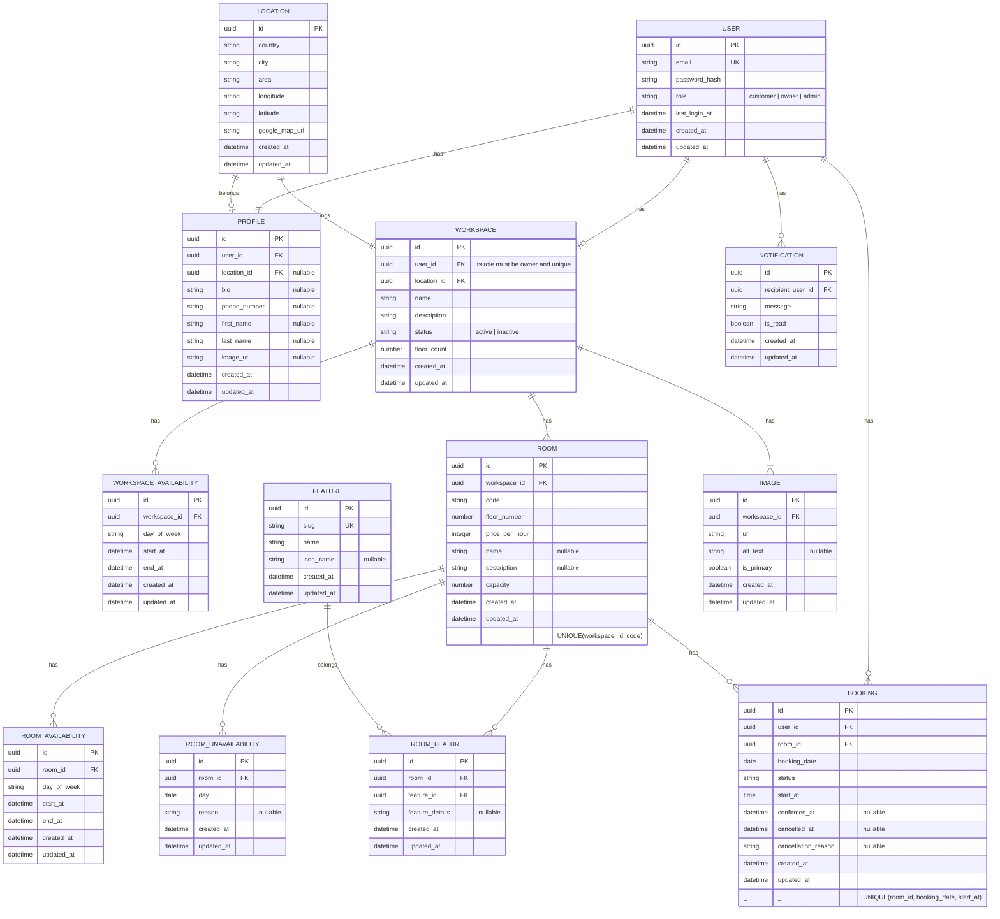

```mermaid
erDiagram
  USER {
    uuid id PK
    string email UK
    string password_hash
    string role "customer | owner | admin"
    datetime last_login_at
    datetime created_at
    datetime updated_at
  }

  PROFILE {
    uuid id PK
    uuid user_id FK
    uuid location_id FK "nullable"
    string bio "nullable"
    string phone_number "nullable"
    string first_name "nullable"
    string last_name "nullable"
    string image_url "nullable"
    datetime created_at
    datetime updated_at
  }

  WORKSPACE {
    uuid id PK
    uuid user_id FK "its role must be owner and unique"
    uuid location_id FK
    string name
    string description
    string status "active | inactive"
    number floor_count
    datetime created_at
    datetime updated_at
  }

  WORKSPACE_AVAILABILITY {
    uuid id PK
    uuid workspace_id FK
    string day_of_week
    datetime start_at
    datetime end_at
    datetime created_at
    datetime updated_at
  }

  ROOM {
    uuid id PK
    uuid workspace_id FK
    string code
    number floor_number
    integer price_per_hour
    string name "nullable"
    string description "nullable"
    number capacity
    datetime created_at
    datetime updated_at
    _ _ "UNIQUE(workspace_id, code)"
  }

  ROOM_AVAILABILITY {
    uuid id PK
    uuid room_id FK
    string day_of_week
    datetime start_at
    datetime end_at
    datetime created_at
    datetime updated_at
  }

  ROOM_UNAVAILABILITY {
    uuid id PK
    uuid room_id FK
    date day
    string reason "nullable"
    datetime created_at
    datetime updated_at
  }

  LOCATION {
    uuid id PK
    string country
    string city
    string area
    string longitude
    string latitude
    string google_map_url
    datetime created_at
    datetime updated_at
  }

  FEATURE {
    uuid id PK
    string slug UK
    string name
    string icon_name "nullable"
    datetime created_at
    datetime updated_at
  }

  BOOKING {
    uuid id PK
    uuid user_id FK
    uuid room_id FK
    date booking_date
    string status
    time start_at
    datetime confirmed_at "nullable"
    datetime cancelled_at "nullable"
    string cancellation_reason "nullable"
    datetime created_at
    datetime updated_at
    _ _ "UNIQUE(room_id, booking_date, start_at)"
  }

  NOTIFICATION {
    uuid id PK
    uuid recipient_user_id FK
    string message
    boolean is_read
    datetime created_at
    datetime updated_at
  }

  ROOM_FEATURE {
    uuid id PK
    uuid room_id FK
    uuid feature_id FK
    string feature_details "nullable"
    datetime created_at
    datetime updated_at
  }

  IMAGE {
    uuid id PK
    uuid workspace_id FK
    string url
    string alt_text "nullable"
    boolean is_primary
    datetime created_at
    datetime updated_at
  }

  USER ||--|| PROFILE : "has"
  USER ||--o| WORKSPACE : "has"
  USER ||--o{ BOOKING : "has"
  USER ||--o{ NOTIFICATION : "has"
  LOCATION ||--|| WORKSPACE : "belongs"
  LOCATION ||--o| PROFILE : "belongs"
  WORKSPACE ||--|{ ROOM : "has"
  WORKSPACE ||--|{ IMAGE : "has"
  WORKSPACE ||--o{ WORKSPACE_AVAILABILITY : "has"
  ROOM ||--o{ ROOM_FEATURE : "has"
  ROOM ||--o{ ROOM_AVAILABILITY : "has"
  ROOM ||--o{ ROOM_UNAVAILABILITY : "has"
  ROOM ||--o{ BOOKING : "has"
  FEATURE ||--o{ ROOM_FEATURE : "belongs"
```