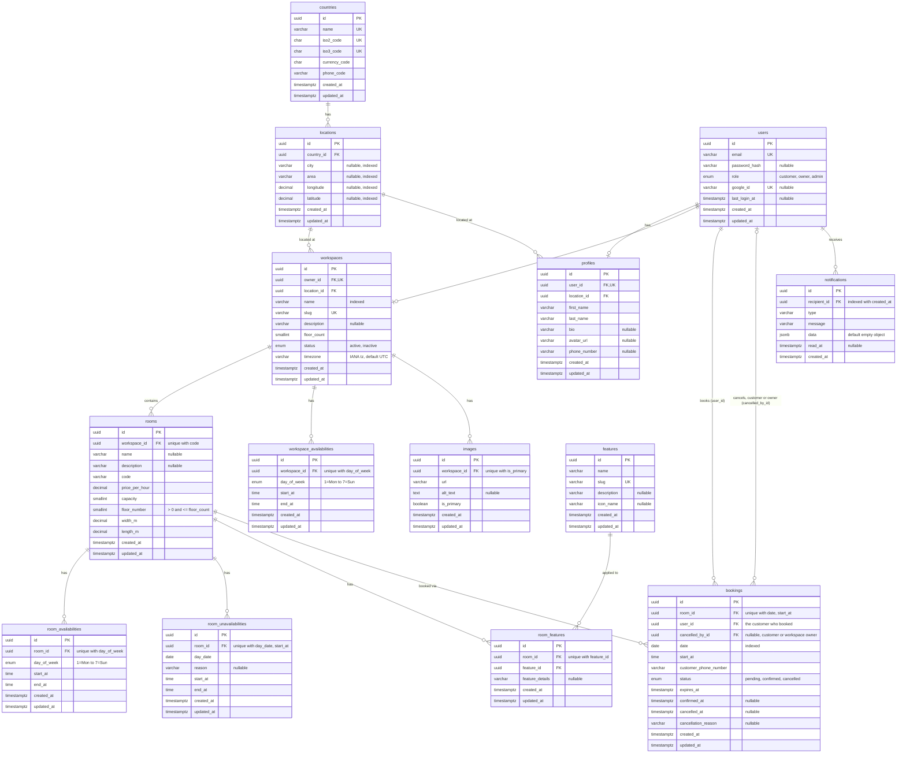

# ERD

```mermaid
erDiagram
    countries ||--o{ locations : "has"
    locations ||--o{ workspaces : "located at"
    locations ||--o{ profiles : "located at"

    users ||--o| profiles : "has"
    users ||--o| workspaces : "owns"
    users ||--o{ bookings : "books (user_id)"
    users |o--o{ bookings : "cancels, customer or owner (cancelled_by_id)"
    users ||--o{ notifications : "receives"

    workspaces ||--o{ rooms : "contains"
    workspaces ||--o{ workspace_availabilities : "has"
    workspaces ||--o{ images : "has"

    rooms ||--o{ room_availabilities : "has"
    rooms ||--o{ room_unavailabilities : "has"
    rooms ||--o{ room_features : "has"
    rooms ||--o{ bookings : "booked via"
    features ||--o{ room_features : "applied to"

    countries {
        uuid id PK
        varchar name UK
        char iso2_code UK
        char iso3_code UK
        char currency_code
        varchar phone_code
        timestamptz created_at
        timestamptz updated_at
    }

    locations {
        uuid id PK
        uuid country_id FK
        varchar city "nullable, indexed"
        varchar area "nullable, indexed"
        decimal longitude "nullable, indexed"
        decimal latitude "nullable, indexed"
        timestamptz created_at
        timestamptz updated_at
    }

    users {
        uuid id PK
        varchar email UK
        varchar password_hash "nullable"
        enum role "customer, owner, admin"
        varchar google_id UK "nullable"
        timestamptz last_login_at "nullable"
        timestamptz created_at
        timestamptz updated_at
    }

    profiles {
        uuid id PK
        uuid user_id FK, UK
        uuid location_id FK
        varchar first_name
        varchar last_name
        varchar bio "nullable"
        varchar avatar_url "nullable"
        varchar phone_number "nullable"
        timestamptz created_at
        timestamptz updated_at
    }

    workspaces {
        uuid id PK
        uuid owner_id FK, UK
        uuid location_id FK
        varchar name "indexed"
        varchar slug UK
        varchar description "nullable"
        smallint floor_count
        enum status "active, inactive"
        varchar timezone "IANA tz, default UTC"
        timestamptz created_at
        timestamptz updated_at
    }

    workspace_availabilities {
        uuid id PK
        uuid workspace_id FK "unique with day_of_week"
        enum day_of_week "1=Mon to 7=Sun"
        time start_at
        time end_at
        timestamptz created_at
        timestamptz updated_at
    }

    images {
        uuid id PK
        uuid workspace_id FK "unique with is_primary"
        varchar url
        text alt_text "nullable"
        boolean is_primary
        timestamptz created_at
        timestamptz updated_at
    }

    rooms {
        uuid id PK
        uuid workspace_id FK "unique with code"
        varchar name "nullable"
        varchar description "nullable"
        varchar code
        decimal price_per_hour
        smallint capacity
        smallint floor_number "> 0 and <= floor_count"
        decimal width_m
        decimal length_m
        timestamptz created_at
        timestamptz updated_at
    }

    room_availabilities {
        uuid id PK
        uuid room_id FK "unique with day_of_week"
        enum day_of_week "1=Mon to 7=Sun"
        time start_at
        time end_at
        timestamptz created_at
        timestamptz updated_at
    }

    room_unavailabilities {
        uuid id PK
        uuid room_id FK "unique with day_date, start_at"
        date day_date
        varchar reason "nullable"
        time start_at
        time end_at
        timestamptz created_at
        timestamptz updated_at
    }

    features {
        uuid id PK
        varchar name
        varchar slug UK
        varchar description "nullable"
        varchar icon_name "nullable"
        timestamptz created_at
        timestamptz updated_at
    }

    room_features {
        uuid id PK
        uuid room_id FK "unique with feature_id"
        uuid feature_id FK
        varchar feature_details "nullable"
        timestamptz created_at
        timestamptz updated_at
    }

    bookings {
        uuid id PK
        uuid room_id FK "unique with date, start_at"
        uuid user_id FK "the customer who booked"
        uuid cancelled_by_id FK "nullable, customer or workspace owner"
        date date "indexed"
        time start_at
        varchar customer_phone_number
        enum status "pending, confirmed, cancelled"
        timestamptz expires_at
        timestamptz confirmed_at "nullable"
        timestamptz cancelled_at "nullable"
        varchar cancellation_reason "nullable"
        timestamptz created_at
        timestamptz updated_at
    }

    notifications {
        uuid id PK
        uuid recipient_id FK "indexed with created_at"
        varchar type
        varchar message
        jsonb data "default empty object"
        timestamptz read_at "nullable"
        timestamptz created_at
    }
```
